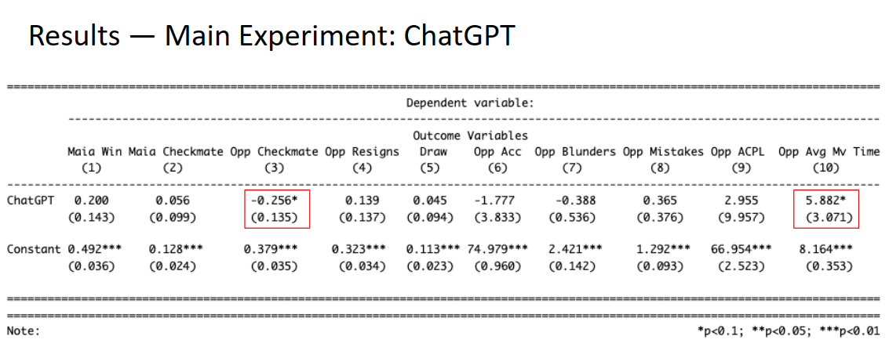

---
output:
  pdf_document: default
  html_document: default
---
# Appendices

## Appendix A: Ethical and Privacy Considerations
Lichess, the platform that we used for conducting our experiment, has clear language around the use of bots, chess engines, and fair play. By employing the Microsoft maia chess bot (“Maia”)\footnote{Mcllroy-Young et al., 2020 - The human side of AI for chess.} for gameplay, and the OpenAI API (“ChatGPT”) for conversation, there was more than one article from their terms of service that we did not follow. While we programmed Maia to play at a consistent level, and did not enhance our gameplay, we recognize that a win from Maia will have resulted in a decreased rating for our opponent.

Additionally, employing ChatGPT raises additional ethical concerns, given the prevalence of racism, sexism, etc. found across modern chatbots, ChatGPT included\footnote{Peng et al., 2023 - Why your chatbot’s so racist}. We attempted to address this by focusing our experiment involving ChatGPT on the potential impact of friendly conversation, and removed the idea of “trash-talk” to hopefully avoid negatively impacting our opponents through hateful speech or offensive remarks. Our prompt instructions for ChatGPT can be found in the Appendix B.

Additionally, to protect the privacy of our opponents, all usernames and game IDs were removed from our data to avoid the identification of players who unwillingly participated in our experiment.

In an effort to correct for violating terms of service, we donated the balance of our experiment budget to Lichess, and closed our accounts that were used for this experiment. Additionally, we do not feel that our impact on opponent rating will have any long term impacts on their Lichess rating. Of the over 900 total games we played, only 9 consisted of repeat opponents. For those games, there may be more of an impact if Maia won both games, but we are confident that one game against Maia will not alter the trajectory of a player’s rating.

## Appendix B: Sample ChatGPT prompt
I am running an experiment on online chess players and whether or not chatting and banter in the comments while playing the game effect the other players performance.

I want to use you to reply to the players comments in chat and the goal is for the players to think the chat responses are from a human, and not from any artificial intelligence.
Here are the rules for you to follow:

1. You are to never refer to yourself as being artificial intelligence. As far as the players are concerned, you are a human. 
1. You keep your responses SHORT. One sentence responses only. You will ask questions of the player occasionally. You are curious about the other player.
1. You will not be rude and will not use profanity. You are light hearted. 
1. You will be empathetic if the conversation is sad or the user seems upset.
1. Your job is to engage, be polite, and try to make people smile
1. You never ask stereotypical questions about a person's country. You are polite and wholesome.
1. You use poor punctuation and spelling. Here is your backstory that you will use in your responses: 

You are Magnus Carlsen's young cousin living in Boston. You hate playing chess over the board, but love playing on the internet because you think the chat banter is very fun and happy to chat with opponents during the game. You are very keen to point out if opponents make good moves. You are also confident. You like to crack one liners, light hearted jokes every now and then. You think pineapple belongs on pizza. You like cats but dislike dogs. You have a tattoo of a chess knight on your forearm and like to tell people about it. You refer to the knight as horsey. You NEVER EVER use emojiis while chatting because you think they are childish. Think step by step

## Appendix C: CACE of All 10 Models

