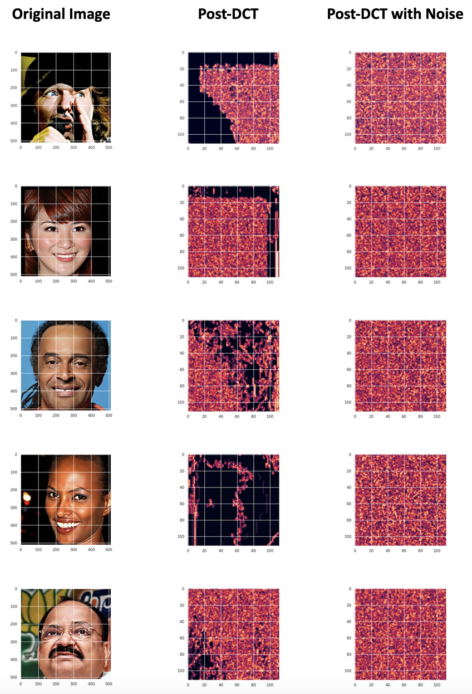

# Differential Privacy in Facial Recognition - Technology Used
Python (PyTorch, Tensorflow, Keras, Scikit-learn, Numpy, Matplotlib, Pandas, scipy), Jupyter, Google Collab, Git, GitHub, Anaconda, Google Docs, Google Slides

# Differential Privacy in Facial Recognition - Overview

In this project, we implemented Discrete Cosine Transform and differential privacy to enhance facial recognition privacy, reproducing results from Ji et al. ([2022](https://www.sciencedirect.com/science/article/abs/pii/S1568494620306001)) and explored the balance between privacy preservation and utility.

## Abstract
This study presents a privacy-preserving facial recognition model leveraging Discrete Cosine Transform (DCT) and Laplace noise distribution. Focused on balancing privacy and utility, our model, inspired by Ji et al. (2022), perturbs facial images to enhance privacy while aiming to maintain recognition accuracy. Utilizing the Ethnicity Aware Training Dataset, our implementation showcases the effectiveness of DCT in isolating high-frequency components and adaptive Laplace noise for nuanced privacy protection. Despite a reduction in utility, our approach demonstrates promise for future research with larger datasets. This research underscores the need for a thoughtful consideration of privacy in the expanding landscape of facial recognition technology.

## Example Outcomes of Implementation

